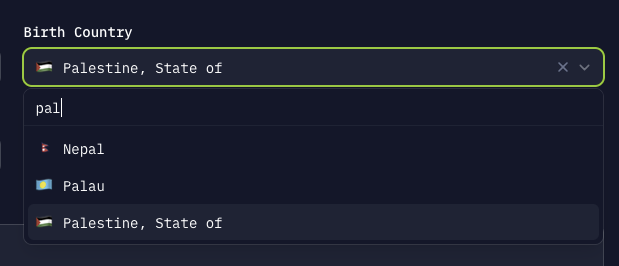

# FilamentCountry

FilamentCountry provides a CountrySelect component, for use in forms.

This plugin provides a searchable select field that displays country flags and names. The selected country is stored using the ISO 3166-1 alpha-2 code.



## Installation

First require the library.

```
composer require witness-data/filament-country
```

Then update your dependencies.

```
composer update
```

## Usage

### Prepare model:

First prepare your Eloquent model by casting the country field(s).

```php
use WitnessData\FilamentCountry\Country;

protected function casts(): array
{
    return [
        'birth_country' => Country::class,
    ];
}
```

### Form schema:

You may use the CountrySelect field in your form's schema the same as any other Filament field.

```php
use WitnessData\FilamentCountry\CountrySelect;

$schema->components([
    CountrySelect::make('birth_country'),
])
```

You can turn off the flag emojis to display just the country names.

```php
use WitnessData\FilamentCountry\CountrySelect;

$schema->components([
    CountrySelect::make('birth_country')
        ->displayFlagEmojis(false),
])
```

The CountrySelect can be modified using any of the functions used to customize a standard Filament Select. You can inject classes as normal.

```php
use WitnessData\FilamentCountry\CountrySelect;

CountrySelect::make('birth_country')
    ->searchable(false)
    ->label(fn (?Model $record): string => $record->first_name . '\'s country of birth'),
```
### Infolist schema:

You may use a standard TextEntry to display country data in your infolist, assuming it is cast properly in your model.

```php
$schema->components([
    TextEntry::make('birth_country')
])
```
